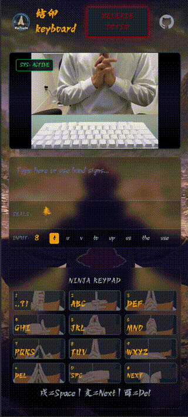

<p align="center">
  
</p>

# 结印 Ketsuin - Ninja Hand Sign Input

[中文文档](README_zh.md)

**Ketsuin** invokes the ancient art of **Ninjutsu** to manipulate the digital realm. Forget your physical keyboard， channel your chakra and weave the **12 Hand Signs** (based on Naruto seals) to conjure text.

Powered by a **YOLOX-Nano** neural network running on **ONNX Runtime Web**, this project transforms your webcam into a Shinobi tool, detecting hand seals in real-time and forging them into words through a strict **T9 Engine**.



## Features

-   **Hand Sign Detection**: Uses a lightweight YOLOX-Nano model via ONNX Runtime to detect 12 distinct hand signs.
-   **T9 Ninja Engine**: Implements a strict T9 input system where each hand sign corresponds to a key on a traditional phone keypad.
-   **Reverse Mapping**: Type manually to see the corresponding hand seal sequence dynamically displayed.
-   **Mobile Optimized**: Fully responsive layout that works on desktop and mobile devices.
-   **Continuous Delete**: Hold the "酉" sign to rapidly delete text.
-   **Continuous Cycle**: Hold the "Boar" sign to rapidly cycle through candidates (300ms interval).
-   **Anti-Misinput**: Intelligent stability delays (100ms for general keys, 40ms for Space) to prevent accidental clicks.

## How to Use

### The 12 Signs

The input method uses the 12 hand signs (Rat, Ox, Tiger, etc.) mapped to the keys 1-9, *, 0, #.

| Sign ID | Hand Sign | T9 Key | Function / Letters |
| :--- | :--- | :--- | :--- |
| **1** | **Rat (子)** | **1** | `. , ? ! : ; 1` |
| **2** | **Ox (丑)** | **2** | `A B C 2` |
| **3** | **Tiger (寅)** | **3** | `D E F 3` |
| **4** | **Hare (卯)** | **4** | `G H I 4` |
| **5** | **Dragon (辰)** | **5** | `J K L 5` |
| **6** | **Snake (巳)** | **6** | `M N O 6` |
| **7** | **Horse (午)** | **7** | `P Q R S 7` |
| **8** | **Ram (未)** | **8** | `T U V 8` |
| **9** | **Monkey (申)** | **9** | `W X Y Z 9` |
| **10** | **Bird (酉)** | **(*)** | **DELETE / BACKSPACE** (Hold to continuous delete) |
| **11** | **Dog (戌)** | **(0)** | **SPACE / CONFIRM CANDIDATE** |
| **12** | **Boar (亥)** | **(#)** | **NEXT CANDIDATE / CYCLE** |

### Basic Operation

1.  **Form a Sign**: Show a hand sign to the camera.
2.  **Input**: The corresponding number is added to your sequence.
3.  **Candidates**: Words matching the sequence will appear.
4.  **Cycle**: Use the **Boar (#)** sign to cycle through candidate words.
5.  **Confirm**: Use the **Dog (0)** sign to confirm the selected word and insert a space.
6.  **Delete**: Use the **Bird (*)** sign to delete the last character.

## Development

### Prerequisites

-   Node.js
-   npm

### how to run local

```bash
npm install
npm run dev
```


### Tech Stack

-   **React + TypeScript + Vite**: Frontend framework.
-   **ONNX Runtime Web**: For running the YOLOX object detection model in the browser.
-   **Tailwind CSS**: For styling and responsive design.

## License

MIT
